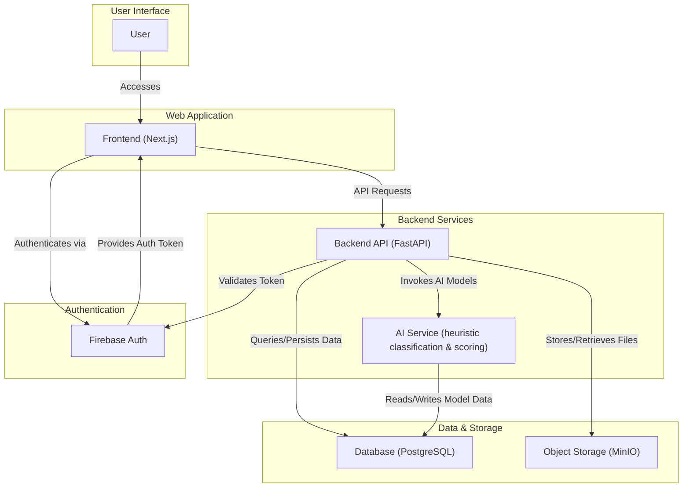
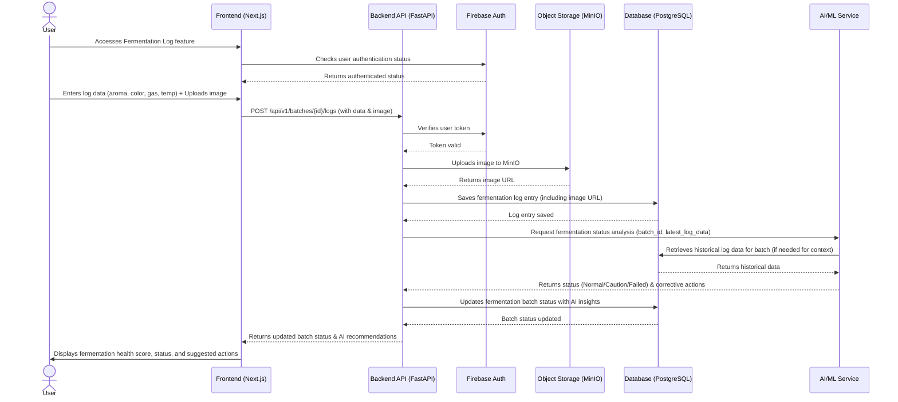

# ARCHITECTURE.md: EcoFlow AI

## System Overview

The EcoFlow AI platform employs a modular, service-oriented architecture designed for scalability, maintainability, and efficient AI integration. It leverages a modern web stack with a React/Next.js frontend for a responsive user experience, a Python FastAPI backend for robust API services and AI orchestration, and PostgreSQL as the primary data store. AI-assisted features (fermentation classification, product recommendation) are implemented as deterministic, data-driven services with heuristic scoring to provide intelligent decision support for eco-enzyme fermentation and product optimization. Firebase Authentication handles secure user access, while MinIO provides scalable object storage for user-generated content. The entire system is designed to run efficiently on a Hostinger VPS for cost-effectiveness during the MVP phase.

## High-Level Architecture Diagram

## Component Breakdown

### Frontend (Next.js)
The Frontend is built with React and Next.js, providing a server-side rendered (SSR) and highly interactive user interface. It is responsible for:
*   Presenting the user dashboard, fermentation logs, product recommendations, and adaptive roadmaps.
*   Handling user input for fermentation parameters, log entries, and business analysis data.
*   Displaying visual progress, alerts, and AI-generated insights.
*   Communicating with the Backend API for data retrieval and submission.
*   Managing user authentication flows via Firebase Auth SDK.
*   Ensuring mobile responsiveness and an eco-friendly educational UI/UX.

### Backend API (FastAPI)
The Backend API, implemented with Python FastAPI, serves as the central application logic layer. Its responsibilities include:
*   Exposing RESTful API endpoints for all frontend interactions.
*   Validating incoming data from the frontend.
*   Orchestrating data persistence to PostgreSQL and file storage to MinIO.
*   Interacting with the AI/ML Service for complex computations and recommendations.
*   Managing user sessions and authorization by verifying Firebase Auth tokens.
*   Implementing core business logic for `Smart Eco-Enzyme Roadmap`, `AI Fermentation Assistant`, `AI Product Recommendation`, `Adaptive Roadmap`, and `Business Analysis`.

### AI Service (heuristic classification & scoring)
This service encapsulates all Artificial Intelligence and Machine Learning functionalities. It is responsible for:
*   **Fermentation Status Classification:** Analyzing user-logged parameters (aroma, color, gas) to classify fermentation health (Normal/Caution/Failed) and suggest corrective actions. This uses deterministic rule-based logic with weighted scoring (no external ML runtime dependencies).
*   **Product Recommendation:** Matching harvested eco-enzyme characteristics with predefined product templates and user goals to recommend the most suitable derivative products. This involves similarity scoring and ranking.
*   **Business Analysis:** Performing financial calculations (COGS, SRP, profit projections) based on user inputs and market data, potentially using statistical models for sensitivity analysis.
*   The service interacts with PostgreSQL to retrieve historical fermentation data for model training/inference and to store model configurations or results.

### Database (PostgreSQL)
PostgreSQL is the relational database management system used for persistent storage. It stores all structured data, including:
*   User profiles and roles.
*   Fermentation batch details, including initial inputs and daily/weekly logs.
*   Product templates, processing roadmaps, and tutorial links.
*   Business analysis parameters and results.
*   Aggregated environmental impact data.
*   AI model metadata and potentially features used for inference.
*   See [DATABASE.md] for detailed schema.

### Object Storage (MinIO)
MinIO provides S3-compatible object storage for unstructured data. It is used for:
*   Storing user-uploaded images related to fermentation logs (e.g., visual inspection of eco-enzyme).
*   Archiving generated PDF reports (e.g., business viability reports, downloadable roadmaps).
*   Storing any other large binary files associated with the platform.

### Firebase Auth
Firebase Authentication is utilized for secure and scalable user identity management. Its responsibilities include:
*   User registration and login (supporting passwordless SMS/email).
*   Managing user sessions and providing authentication tokens.
*   Integrating with the frontend SDK for seamless user experience.
*   Allowing the backend to verify user identity and enforce access control.

## Critical Flow Sequence Diagram: AI Fermentation Assistant

This sequence diagram illustrates the process of a user logging fermentation data and receiving AI-driven feedback on their batch's health.

## Deployment Strategy

The EcoFlow AI platform is designed for deployment on a single Virtual Private Server (VPS) instance, specifically Hostinger VPS, for the MVP phase. This strategy prioritizes cost-effectiveness and ease of management for initial development and competition submission.

*   **Hostinger VPS:** The primary hosting environment for all core application components.
    *   **Frontend (Next.js):** Deployed as a Node.js application, potentially using a process manager like PM2 or containerized with Docker and orchestrated by Docker Compose. It will serve the web application and handle SSR.
    *   **Backend API (FastAPI):** Deployed as a Python application, likely using a WSGI server like Gunicorn or Uvicorn, also managed by PM2 or Docker/Docker Compose.
    *   **AI/ML Service:** Integrated directly within the FastAPI application or as a separate Python service running on the same VPS, communicating via internal network calls or shared memory. It implements heuristic classification and scoring services (no external ML runtime dependencies).
    *   **Database (PostgreSQL):** Installed directly on the VPS as a managed service or within a Docker container, configured for local access by the Backend API and AI/ML Service.
    *   **Object Storage (MinIO):** Installed as a standalone service on the VPS, configured to store data on the VPS's disk. It will expose an S3-compatible API for the Backend to interact with.
*   **Firebase Auth:** This is a cloud-based service managed by Google. The frontend SDK directly communicates with Firebase, and the backend uses Firebase Admin SDK for token verification, requiring internet connectivity.
*   **Monitoring (Prometheus + Grafana):** Installed on the same VPS to collect metrics from the application components and the host system, providing real-time dashboards and alerting.

For future scalability beyond the MVP, a migration path to a managed Kubernetes cluster (e.g., Google Kubernetes Engine, AWS EKS) is envisioned, allowing for easier scaling of individual services and improved resilience.