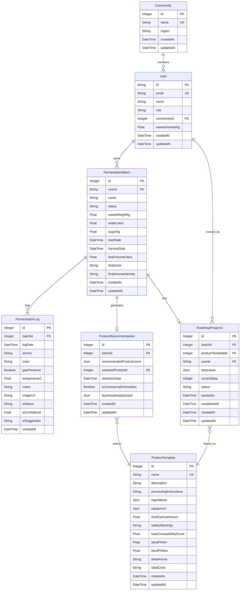

# DATABASE.md: EcoFlow AI

## 1. Entity Relationship Diagram (ERD)

The following ERD illustrates the core entities within the EcoFlow AI platform and their relationships. Schema is managed with SQLAlchemy + Alembic migrations on PostgreSQL.

## 2. Table Definitions

Seven tables managed via Alembic migrations (`alembic upgrade head`).

### communities

Stores community/regional entities for the community monitoring feature (FR-7).

| Field | Type | Description |
|:---|:---|:---|
| `id` | Integer (PK) | Auto-increment primary key. |
| `name` | String (UK) | Unique community name. |
| `region` | String (Indexed) | Region of the community (nullable). |
| `created_at` | DateTime | Timestamp of creation. |
| `updated_at` | DateTime | Timestamp of last update. |

### users

Stores user authentication and profile information.

| Field | Type | Description |
|:---|:---|:---|
| `id` | String (PK) | Firebase UID. |
| `email` | String (UK, Indexed) | User's email address. |
| `name` | String | User's full name. |
| `role` | String | Role: `user`, `admin`, `community_admin`, `platform_admin`. Default `user`. |
| `community_id` | Integer (FK, Indexed) | FK to `communities.id` (nullable). |
| `waste_diverted_kg` | Float | Cumulative organic waste (kg) diverted. |
| `created_at` | DateTime | Timestamp of creation. |
| `updated_at` | DateTime | Timestamp of last update. |

### fermentation_batches

Represents a single eco-enzyme fermentation process initiated by a user.

| Field | Type | Description |
|:---|:---|:---|
| `id` | Integer (PK) | Auto-increment primary key. |
| `user_id` | String (FK) | FK to `users.id`. |
| `name` | String | User-defined name for the batch. |
| `status` | String | Status: `pending`, `harvested`, `success` (default `pending`). |
| `waste_weight_kg` | Float | Initial waste weight in kg. |
| `water_liters` | Float | Initial water volume in liters. |
| `sugar_kg` | Float | Initial sugar weight in kg. |
| `start_date` | DateTime | Fermentation start date. |
| `harvest_date` | DateTime | Harvest date (nullable). |
| `final_volume_liters` | Float | Final harvested volume (nullable). |
| `final_color` | String | Final color (nullable). |
| `final_aroma_intensity` | String | Final aroma intensity, e.g. `sweet`, `sour` (nullable). |
| `created_at` / `updated_at` | DateTime | Timestamps. |

### fermentation_logs

Records periodic observations and AI feedback for a batch.

| Field | Type | Description |
|:---|:---|:---|
| `id` | Integer (PK) | Auto-increment primary key. |
| `batch_id` | Integer (FK) | FK to `fermentation_batches.id`. |
| `log_date` | DateTime | Date/time of the log entry. |
| `aroma` | String | Observed aroma (e.g. `sweet`, `sour`). |
| `color` | String | Observed color (e.g. `amber`, `brown`). |
| `gas_presence` | Boolean | Whether gas bubbles observed. |
| `temperature_c` | Float | Temperature in Celsius. |
| `notes` | Text | User notes (nullable). |
| `image_url` | String | MinIO object URL for checkpoint photo (nullable). |
| `ai_status` | String | `Normal`, `Caution`, or `Failed`. |
| `ai_confidence` | Float | Rule-based confidence score (0-1). |
| `ai_suggestion` | Text | Corrective action suggestion (nullable). |
| `created_at` | DateTime | Timestamp of creation. |

### product_templates

Defines eco-enzyme derivative products, processing instructions, and ideal characteristics used by the recommendation engine.

| Field | Type | Description |
|:---|:---|:---|
| `id` | Integer (PK) | Auto-increment primary key. |
| `name` | String (UK, Indexed) | Product name (e.g. `Household Cleaner`). |
| `description` | Text | Product description. |
| `processing_instructions` | Text | Step-by-step processing guide. |
| `ingredients` | JSON | List of additional ingredients. |
| `equipment` | JSON | List of required equipment. |
| `time_estimate_hours` | Float | Estimated processing time in hours. |
| `safety_warnings` | Text | Safety considerations. |
| `base_compatibility_score` | Float | Base compatibility score (0-1, default 0.5). |
| `ideal_ph_min` / `ideal_ph_max` | Float | Ideal pH range for the product (nullable). |
| `ideal_aroma` | String | Ideal aroma (`sour`, `sweet`) (nullable). |
| `ideal_color` | String | Ideal color (`brown`, `amber`, `dark_brown`, `light_brown`) (nullable). |
| `created_at` / `updated_at` | DateTime | Timestamps. |

### product_recommendations

Stores the ranked recommendations for a harvested batch, the user's product selection, and business analysis data.

| Field | Type | Description |
|:---|:---|:---|
| `id` | Integer (PK) | Auto-increment primary key. |
| `batch_id` | Integer (FK, Indexed) | FK to `fermentation_batches.id` (one-to-one). |
| `recommended_products_json` | JSON | Ranked list of recommendations with compatibility scores. |
| `selected_product_id` | Integer (FK) | FK to `product_templates.id` — the product chosen by the user (nullable). |
| `selection_date` | DateTime | When the user made the selection (nullable). |
| `is_commercial_orientation` | Boolean | True if the user intends commercial use (UMKM). |
| `business_analysis_json` | JSON | Financial analysis: COGS, SRP, margin, projections (nullable). |
| `created_at` / `updated_at` | DateTime | Timestamps. |

### roadmap_progress

Tracks step-by-step production progress for the selected product (FR-4).

| Field | Type | Description |
|:---|:---|:---|
| `id` | Integer (PK) | Auto-increment primary key. |
| `batch_id` | Integer (FK, Indexed) | FK to `fermentation_batches.id`. |
| `product_template_id` | Integer (FK, Indexed) | FK to `product_templates.id`. |
| `user_id` | String (FK, Indexed) | FK to `users.id`. |
| `steps_json` | JSON | List of processing steps with statuses. |
| `current_step` | Integer | Current step index (default 0). |
| `status` | String | `not_started`, `in_progress`, `completed`. |
| `started_at` / `completed_at` | DateTime | Start/end timestamps (nullable). |
| `created_at` / `updated_at` | DateTime | Timestamps. |

## 3. Schema Management

- **ORM:** SQLAlchemy 2.x declarative models in `backend/app/models/base.py`.
- **Migrations:** Alembic, 5 revision files in `backend/alembic/versions/`:
  - `4fbe94f9e549` — initial schema
  - `f27716d2914e` — add `image_url` to `fermentation_logs`
  - `ea7cfb017895` — (no-op fix marker)
  - `b1c2d3e4f5a6` — communities + `users.community_id`
  - `c1d2e3f4a5b6` — ideal characteristics on `product_templates`
- **Apply:** `alembic upgrade head` (uses `DATABASE_URL` from env / `.env`).
- **Database:** PostgreSQL 16 (`docker-compose up -d postgres`).

## 4. Indexes & Constraints

- `users.email` — unique index
- `users.community_id` — FK index
- `communities.name` — unique
- `communities.region` — index
- `product_templates.name` — unique
- `fermentation_batches.user_id` → `users.id`
- `fermentation_logs.batch_id` → `fermentation_batches.id`
- `product_recommendations.batch_id` → `fermentation_batches.id`
- `roadmap_progress.batch_id` / `product_template_id` / `user_id` — indexed FKs
